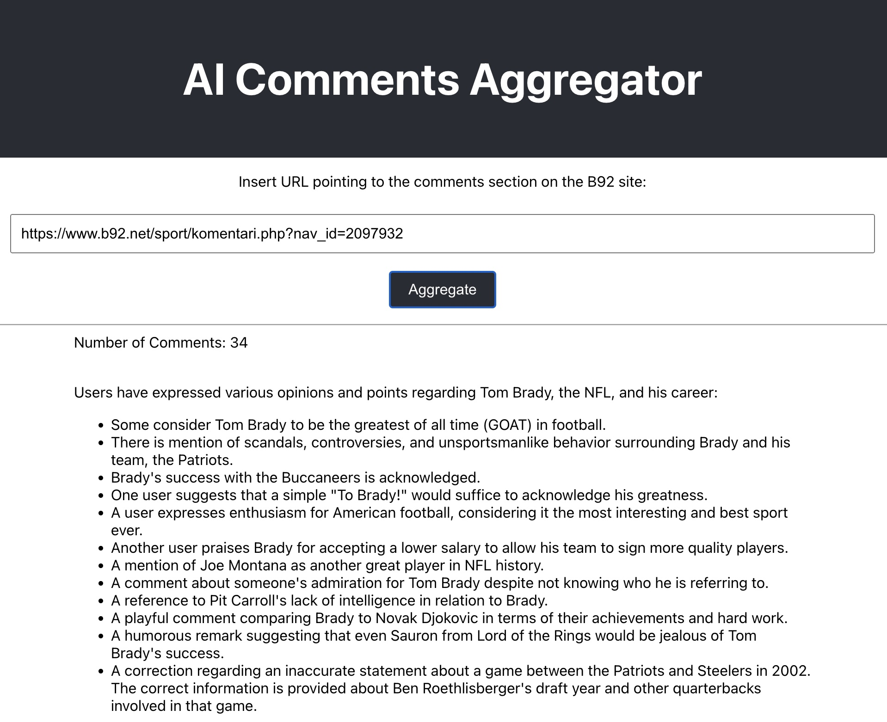
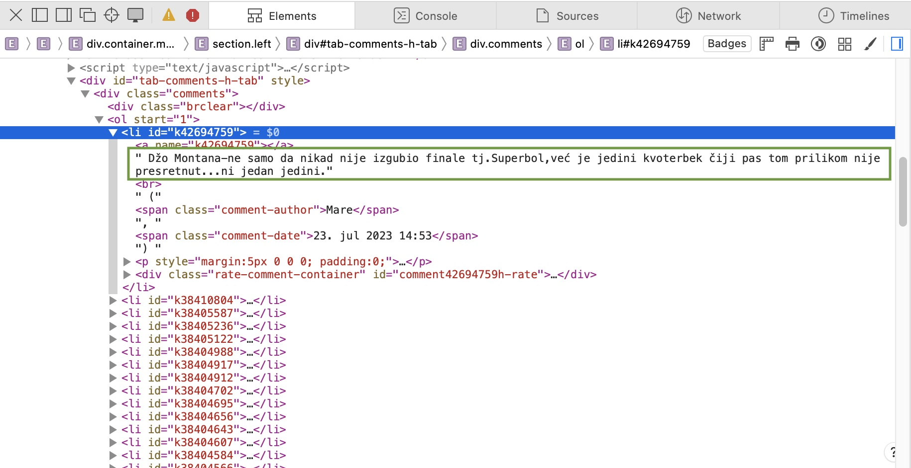

# Introduction
This project is used purely as an educational material to teach and demonstrate in practice the following topics:

- Basics of the following technologies:
    - React based web application in JavaScript
    - Public OpenAI service to analyze and generate text in any natural language.
- How to utilize batch processing to combat API rate limits.
- What is web scraping and how to use it to acquire text input.
- How to overcome the CORS limitations when accessing a third party site.
- How to utilize [GitHub Dependabot](https://github.com/skills/secure-repository-supply-chain) to receive notifications and pull requests regarding version updates and vulnerabilities. 
- The benefits of using an AI pair programming technique with GitHub Copilot.
- How to properly manage secrets in an application.
- The importance of properly separating UI styles from rest of the application logic.

# Usage
The user interface is rudimentary to keep things simple. The *Aggregate* button will trigger the collection of comments from the specified URL and their analysis. 
The summary of comments will show up in the lower part of the UI in English (see the screenshot below).
Using OpenAI to perform translation on-the-fly is an extra feature by which anybody can easily understand what is written in foreign articles.
Finally, it is possible to ask OpenAI to return the summary nicely formatted in HTML, which is useful when the summary is to be published on a website.
This is known as [prompt engineering](https://aws.amazon.com/what-is/prompt-engineering/).

To demonstrate how easy it is to switch to any language, the comments are picked up from the [B92 news site](https://www.b92.net) (in Serbian). This site traditionally has very active comments sections.
All comments are essentially anonymous, as they are associated with arbitrary nicknames chosen by users.
Nonetheless, even these nicknames are removed before processing data via OpenAI.

It is assumed that the user will enter a URL that points to comments section on this site. 
Furthermore, to achieve best results, only sports related articles should be used. 
For example, [this article](https://www.b92.net/sport/komentari.php?nav_id=2097932) is a good candidate. The reason is that such comments are usually short and to the point.

> In order to avoid hitting the OpenAI API rate limit, the application will make a random sample of 50 comments (if there are more than 50 comments). 
> These are later grouped into batches of 20 to decrease the number of calls. These parameters are fixed in this educational project, but they can be easily made configurable.

If the application detects that not all secrets were provided as environment variables, then it will simply print a short message at the screen. A new version will need to be deployed having all these secrets specified.



> Observe that hitting the *Aggregate* button in succession will produce different responses. This is because the OpenAI service is not deterministic.

## Setup
To avoid intricacies of deploying and communicating with the CORS proxy server, the application can be run locally.
The following steps are required:

1. Install [git](https://git-scm.com) and clone the repository.
2. Install [Node Version Manager (nvm)](https://github.com/nvm-sh/nvm) and use Node version 20.10 or higher.
3. Inside the root folder of the repository, run `npm install` to install all dependencies.
4. Set the environment variable REACT_APP_OPENAI_API_KEY to the value of your OpenAI API key.
5. Run `npm start` to start the application.
6. Open the browser and navigate to `http://localhost:3000`.

Of course, you can use any other IDE or editor to run and/or further develop the application.

# Architecture
The [article](https://httptoolkit.com/blog/cors-proxies/) about CORS proxying is helpful to understand the overall architecture of this application.
It also drives attention to many security concerns that must be addressed when using such a technique.
This application uses an internal CORS server listening at port 8080. The server has a dedicated endpoint
`/api/forward` to proxy GET requests toward any site passed inside the `url` query parameter.
For each site, you also need a separate module that implements the web scraping logic and extracts comments (see the [b92-comments-extractor.js](src/b92-comments-extractor.js) file).

## Testing the Proxy Server
If you have followed the [setup](#setup) procedure, then the proxy server should run at port 8080. 
To test it, open a terminal and run the following command:
```
curl -I "http://localhost:8080/api/forward?url=https%3A%2F%2Fwww.b92.net%2Fsport%2Fkomentari.php%3Fnav_id%3D2097932"
```
The response should look like this:
```
HTTP/1.1 200 OK
X-Powered-By: Express
Access-Control-Allow-Origin: *
Content-Type: application/octet-stream
Content-Length: 200052
ETag: W/"30d74-yeexUc2asriSIN03Zkb+fnXxab8"
Date: Sun, 17 Dec 2023 23:34:30 GMT
Connection: keep-alive
Keep-Alive: timeout=5
```
Observe the response header `Access-Control-Allow-Origin: *`. This is the CORS header that allows any origin to access the resource.
You can read about more sophisticated options in the documentation of the [cors](https://expressjs.com/en/resources/middleware/cors.html) package.
The `url` query parameter is URL encoded. The value of this parameter is the URL of the B92 article whose comments are to be extracted.
There are plenty of online tools to URL encode a string. For example, [this one](https://www.urlencoder.org/).

## Web Scraping
The B92 site has no API to access it's content. Therefore, a web scraping technique is used to extract the text from the HTML page. The [cheerio](https://cheerio.js.org/) library is used for this purpose.
To figure out the structure of the HTML page, the _InspectElement_ browser feature was used. The following screenshot shows the HTML structure of the comments section on the B92 site.
To get this structure, right-click on the page where the element of interest is displayed and select _InspectElement_ (or similar) from the context menu.



All comments are inside the `div` section with an `id="tab-comments-h-tab"` (denotes the tab that lists comments in chronological order).
Each comment is inside a list item of the `div` section with a `class="comments"`. One concrete comment is shown inside a green rectangle.

Web scraping is a very brittle technique. Any change in the HTML structure of the page will break the scraping logic. One way to remedy this problem is make scraping rules external and configurable. This is not done in this project to keep things simple.

> You must ensure that the web scraping logic is not used to extract data from a site that explicitly forbids such a practice. This is usually stated in the site's terms of use.

## Scaling the Application to Handle Large Number of Comments
The OpenAI service has different rate limits depending on the subscription level. The free tier cannot be used to handle large volume of comments.
Besides switching to a paid subscription, the application can be scaled by employing the [MapReduce](https://en.wikipedia.org/wiki/MapReduce) programming model in multiple stages. Namely,
each stage would perform a summarization of a subset of comments. Gradually summaries of summaries would be produced. 
The final stage would aggregate the results from all previous stages.

> Again, any such scaling technique must be used in accordance with the target site's terms of use! This approach is only mentioned for educational purposes.
